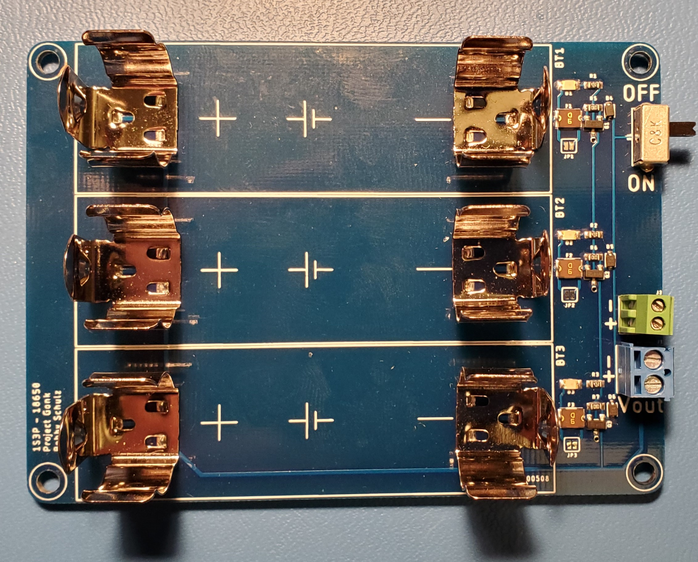
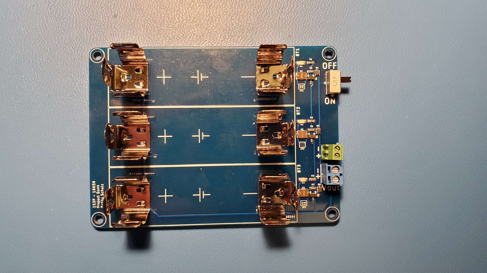
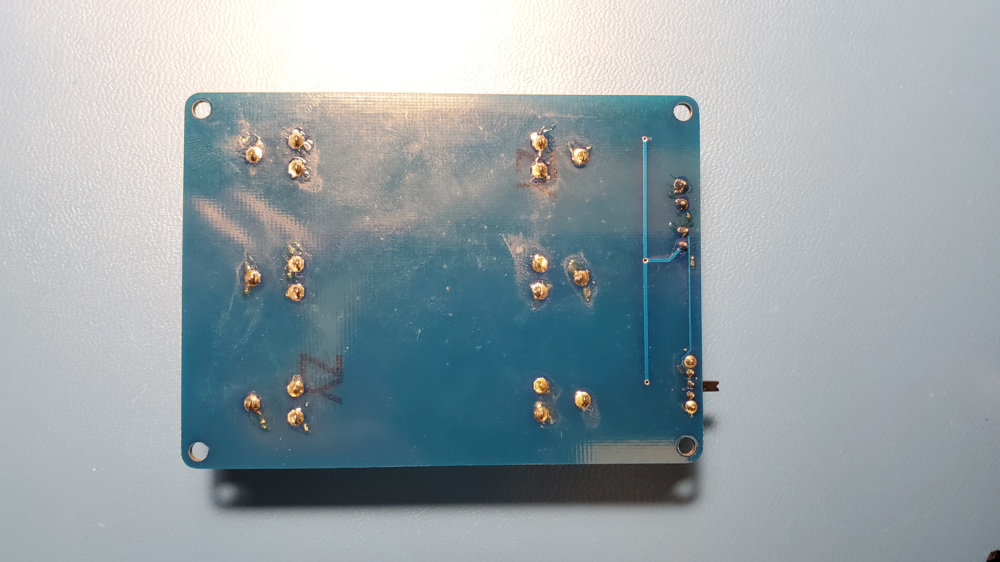

# Project-Gonk 
### Battery: 18650 
### Configuration: 1S3P
Battery holder with integrated protection and control

# Usage
1. Toggle switch to "<b>OFF</b>" position
2. Verify battery voltage (Maximum difference between highest and lowest voltage cell should be less than <b>0.2V</b>)
3. Insert batteries into holders (<b>Note polarity markings</b>)
4. Verify polarity - if any of the <b>red indicator lamps</b> are lit, <b>stop!</b> Remove offending batteries and fix polarity before proceeding
5. If no red lamps are lit, connect external system to either of the <b>Vout</b> connectors (<b>observe polarity of connector!</b>)
6. Toggle switch to "<b>ON</b>" position when ready to activate 

# Repo Roadmap
#### [Documents](Documents/) 

General document and image storage for repo and README

#### [Hardware](Hardware/)

Current board files (Eagle), Bill of Materials (BoM), and other design documents

#### [Production](Production/)

Contains the various Gerber and pick and place files required to have the Printed Circuit Boards (PCBs) manufactured or populated 

## Overview
* **Type:** Power
* **Interfaces:** Power
* **Release Version:** v0.1

<!--  -->

<!--  -->

## Features
### On-Board
* Power switch
* Reverse battery indication
* Poly fuse per battery

### Interface

## Specifications
* **Output Current (Max Constant):** 5.25A
* **Current Per Battery (Max Constant):** 1.75A

## Jumper Settings 

**Configuration Jumpers**
| Jumper | Purpose | Open | Closed | Default | 
| ------ | ------- | ---------- | ---------- | ----- | 
| `JP1` | Bypass poly fuse on battery 1 | Short Circuit Protection Enabled | Short Circuit Protection Disabled | Open |  
| `JP2` | Bypass poly fuse on battery 2 | Short Circuit Protection Enabled | Short Circuit Protection Disabled | Open |
| `JP3` | Bypass poly fuse on battery 3 | Short Circuit Protection Enabled | Short Circuit Protection Disabled | Open | 

## Known Issues/Errata

#### None!